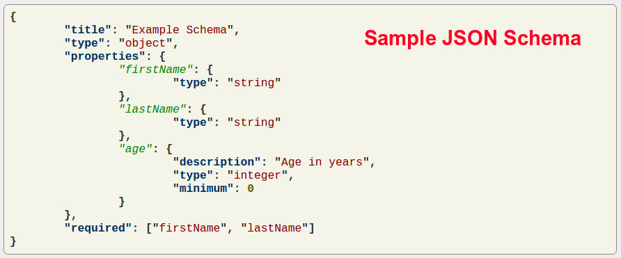

# My own X

## Motivation

Largely inspired by [https://github.com/danistefanovic/build-your-own-x](https://github.com/danistefanovic/build-your-own-x). 
No better way to understand a technology than to try and create your own version of X.

This also serves to show recruiters and employers of past projects I have worked on. Please don't ask me to build [Goose Game]() again. It's already there!

###### Fair warning
The implementation of some of these solutions might not be prestine, I built them as a learning tool.

## Projects

####  Goose game

Goose game is a game where two or more players move pieces around a track by rolling a die. The aim of the game is to reach square number sixty-three before any of the other players and avoid obstacles. ([wikipedia](https://en.wikipedia.org/wiki/Game_of_the_Goose))

| Status |  Specification | Code Documented |  Unit Test | Known Issues | Link | Solution |
|--------|--------|--------|--------|--------|--------|--------|
|  DONE  |  [Goose.md](specs/goose.md) | NO | NO | MULTIPLE | [goose_game](goose_game) | SCALA |

*****
####  Json validator

A simple REST service in Scala for validating JSON documents against JSON schema

| Status |  Specification | Code Documented |  Unit Test | Known Issues | Link | Solution |
|--------|--------|--------|--------|--------|--------|--------|
|  DONE  |  [JsonValidator.md](specs/json-validator.md) | NO | NO | NO | [json-validator](json-validator) | SCALA, Play Framework!, SLICK |

####  Mailinator

Mailinator is a web service for checking email sent to public, temporary email addresses. There are many similar services, but Mailinator was one of the first.

| Status |  Specification | Code Documented |  Unit Test | Known Issues | Link | Solution |
|--------|--------|--------|--------|--------|--------|--------|
|  DONE  | [Mailinator.md](specs/mailinator.md) | NO | INCOMPLETE | MULTIPLE | [mailinator](mailinator) | SCALA, http4s |

*****

####  Pastebin

A pastebin or text storage site is a type of online content hosting service where users can store plain text, e.g. to source code snippets for code review via Internet.

| Status |  Specification | Code Documented |  Unit Test | Known Issues | Link | Solution |
|--------|--------|--------|--------|--------|--------|--------|
|  DONE  |  [Pastebin.md](specs/pastebin.md) | NO | NO | MULTIPLE | [pastebin](pastebin) | SCALA, Play framework!, SLICK, ElasticSearch, sbt |

*****

## Organization of projects

Each project is a git submodule and exists as a seperate repository.

To clone an individual project you need to clone that repository.
Pull requests and issues are opened in each project's repo.

## Contributing

All contributions are accepted :) See [Contributing.md](Contributing.md)

